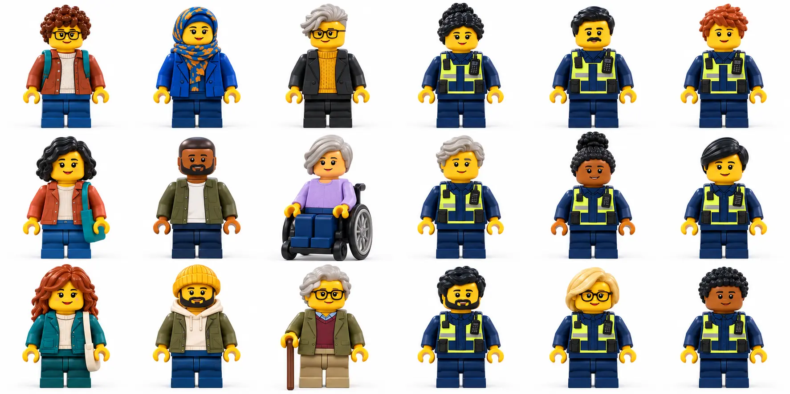

# Stopped: Both Sides

**An interactive learning game for the public and Gardaí.**

Explore encounters with An Garda Síochána through fictional situations, choices and explanations. Learn about rights and responsibilities, examine the reasoning behind a decision, and switch perspectives to see the same situation from the other side.

**[Play the live game — public perspective](https://samobrienolinger.github.io/stopped-both-sides/)** · **[Start from the Garda perspective](https://samobrienolinger.github.io/stopped-both-sides/garda/)**

**HTML · CSS · JavaScript modules · GitHub Pages · No application dependencies**

[How to play](#how-to-play) · [Characters](#characters-and-switching-sides) · [Scoring](#scores-and-progress) · [Evidence](#evidence-and-content-review) · [Getting started](#getting-started) · [Documentation](#documentation-and-repository-guide) · [Credits](#credits-and-reuse)

> **Project status:** An independent educational prototype about the **Republic of Ireland**. It provides general learning, not legal advice or accredited Garda training. The documented source review is dated **7 September 2026**; specialist legal, community and language review remain opportunities for further development. Northern Ireland has different laws.

## Purpose and audience

The goal is to make information about Garda encounters easier to understand and to encourage informed, fair and thoughtful decisions. Learning combines plain English, scenario-based choices, feedback and links to the underlying sources.

| Perspective | Who it is for | Learning focus |
| --- | --- | --- |
| **Member of the public** | People learning about their rights and responsibilities | Questions, searches, arrest, access to support and concerns about unfair treatment |
| **Garda** | Garda learners and people exploring policing decisions | Evidence, assumptions, bias, communication, fair treatment and reconsidering decisions |

Both perspectives belong to one game and one repository. The public perspective uses teal and mint; the Garda perspective uses muted blue. Written role labels and selected states identify the active perspective alongside colour.

The guiding principles are clear information, evidence-based reasoning, dignity and reflection. A member of the public is never scored as responsible for another person's misconduct. The game supports learning and discussion; it does not assess real incidents or certify professional competence.

## What you can explore

- **14 shared situations and 59 stages**, each with perspectives for a member of the public and a Garda.
- Public-rights situations about street questions, a bag search, arrest, the station, a young person and concerns about racism.
- Garda situations about suspicion, descriptions, search grounds, communication, assumptions about age, colleague pressure, new evidence and supervision.
- **18 selectable LEGO-style characters**: nine for each side, with a randomly assigned character opposite you.
- Character changes and perspective switching at each stage, preserving the situation and each role's answers.
- Immediate explanations, source links and a final comparison of both perspectives.
- Saved learning progress, separate role scores, replay and a resume point.
- English and Gaeilge in shared play, with adjustable reading settings.
- Paired hero images with **Public perspective** and **Garda perspective** controls centred at the top. Images stack on smaller screens and sit side by side on wider screens.

The original single-role practice remains available: six public situations with 26 decision nodes, and eight Garda situations. A stage in original practice can transfer into its matching shared situation.

## How to play

1. **Choose a side and character.** Open the [public game](https://samobrienolinger.github.io/stopped-both-sides/) or [Garda game](https://samobrienolinger.github.io/stopped-both-sides/garda/), select a LEGO character, then choose a situation. The other character is assigned at random and stays with that encounter.
2. **Read the scene and choose a response.** Each choice has an explanation and a sourced learning point.
3. **Change character or switch sides.** Use **Change character** at any stage, including feedback and recap. Switching sides puts you in the other character's place; you can change that character too. Both role answers and scores are retained.
4. **Continue the situation.** The active role's choice determines the next branch; the other answer remains available for comparison.
5. **Review and replay.** Compare the decisions in the recap, revisit a learning point, or return later using saved progress.

There is no sign-up or timer. All gameplay runs in the browser, with no AI service involved during play.

## Characters and switching sides

Choose from **18 LEGO-style characters — nine for each side**. The cast includes men, women and characters with an ambiguous gender presentation. The picker asks you to select a fictional character; it does not collect personal identity information.



**[Choose a public character](https://samobrienolinger.github.io/stopped-both-sides/#encounters/public)** · **[Choose a Garda character](https://samobrienolinger.github.io/stopped-both-sides/garda/#encounters/garda)**

Your character and the person on the other side appear throughout the encounter, including feedback and the final recap. **You** and **Other side** labels identify who you are currently playing.

| Action | What happens to the characters |
| --- | --- |
| **Start a shared situation** | Your selected character appears, and the character opposite you is chosen at random. |
| **Continue or revisit a stage** | The same pair stays with the situation. |
| **Switch perspective** | You take the existing opposite character's place. Both sides' answers and scores are retained. |
| **Change character** | Only your active character changes. The other character, current stage, answers and scores stay in place. To change the other character, switch sides first. |
| **Reload, resume or switch sites** | The saved encounter keeps both characters alongside your progress. |
| **Replay a shared situation** | You keep the character for the chosen role and receive a newly randomised counterpart, which may be the same character by chance. |

Characters are visual avatars. Each situation retains its own names, ages and facts; appearance does not alter legal responsibilities, available choices or scoring. Older saved encounters and links remain readable. In original single-role practice, **Change character** opens the matching shared situation at the same stage and preserves the selected answer.

See the [character guide](docs/CHARACTERS.md) for persistence, compatibility and artwork details.

## Scores and progress

Scoring adapts the running points, feedback, final result and saved best-score approach used in **AllyIndex** to a game with branching situations and two perspectives.

| Result | How it works |
| --- | --- |
| **Stage feedback** | 1 point for an appropriate response on the stated facts; 0 where the reasoning needs review. More than one response can earn a point. |
| **Current route** | Separate scores for each role. A completed role result requires an answer in that role at every stage on the finished route. |
| **Saved learning progress** | The best point earned at each unique stage, up to 59 per role. Repeating a mastered stage does not add points. |
| **Replay** | Latest and best completed results are retained. Revisiting a stage can improve learning progress. |

There are no point penalties for taking time, switching perspective or requesting help. Scores reflect the reasoning taught in the exercise; they do not measure personal bias, reward avoiding arrest or establish that the game changes behaviour.

See [Perspectives and scores](docs/PERSPECTIVES-AND-SCORES.md) for the rubric, branch behaviour, storage rules and AllyIndex attribution.

## Accessibility and language

Shared play supports **English and Gaeilge**, including all 14 situations, 59 stages, both roles' choices, feedback and recaps. Changing language preserves the active situation and scores. About, accessibility and source-reference sections remain in English and are labelled accordingly. The Irish translation is a draft learning aid awaiting independent language and legal review.

Reading controls provide larger text, high contrast, increased spacing and reduced motion. The interface includes semantic controls, visible keyboard focus, status announcements, responsive layouts and locally hosted fonts. Role labels supplement the different perspective colours.

Character controls work with a keyboard and have English/Gaeilge labels, visible selected states and touch targets of at least 48px. Opening the in-game picker focuses its heading; **Done** returns focus to **Change character**. Its heading and controls wrap on narrow screens, including with enlarged Irish text.

The implementation targets **WCAG 2.2 AA**. Automated checks cover selected contrast, navigation and translation behaviours; they are not an accessibility certification. Real-device, screen-reader and disabled-user testing remain necessary. See [Accessibility and language](docs/ACCESSIBILITY-AND-LANGUAGE.md) for coverage and review opportunities.

Both perspectives use a shared **mobile-first layout**, with **72 browser checks in Chromium, Firefox and WebKit**, from 320px phones to 2560px desktops, including landscape and touch input. The checks also run against the live site after Pages publication. Reading settings work when native dialog support is unavailable. See [browser compatibility and tested coverage](docs/BROWSER-COMPATIBILITY.md) for the matrix, commands and limits; engine tests do not certify every browser version or physical device.

## Privacy

Choices, scores, character selections, reading preferences and a resume point are saved in browser storage. There are no accounts, analytics, tracking scripts or forms for real incidents.

Each perspective keeps a separate record. Switching between them carries and merges progress through the game link. Copying that link can share the learning record it contains. Separate browsers and devices do not synchronise automatically; clearing one perspective's progress does not clear the other's record or previously copied links. Hosting services may retain ordinary access logs.

Preferred characters are stored separately from scores. Clearing progress keeps those character preferences. If browser saving is blocked, character selection and changes still work for the current visit.

See [Persistence and transfer](docs/PERSPECTIVES-AND-SCORES.md#persistence-and-transfer) for storage limits and recovery behaviour.

## Evidence and content review

The situations draw on Irish legal and rights information, community research and a selected critical review of academic literature on policing decisions and bias. Each decision links to its supporting sources. The research record distinguishes jurisdiction, access limitations, findings and their use in the game; it does not claim an exhaustive literature review or proven training effectiveness.

Key public-rights resources include:

- [Citizens Information — Questioning and surveillance](https://www.citizensinformation.ie/en/justice/arrests/questioning-and-surveillance/).
- [INAR — policing resources](https://inar.ie/?s=Police) and the [INAR / ICCL community and rights report on policing and racial discrimination (PDF)](https://inar.ie/wp-content/uploads/2024/04/1.-POLICING-AND-RACIAL-DISCRIMINATION-1.pdf).
- [ICCL — Criminal Justice and Garda Powers guide, second edition (2014)](https://www.iccl.ie/resources/know-your-rights-criminal-justice-and-garda-powers-2nd-edition-june-2014/).
- [DPP — Letters of rights](https://www.dppireland.ie/criminal-justice-system/letters-of-rights/), the [Legal Aid Board — Garda Station Legal Advice Revised Scheme](https://www.legalaidboard.ie/about-the-legal-aid-board/criminal-legal-aid/the-garda-station-legal-advice-revised-scheme/) and [Fiosrú — FAQs](https://www.fiosru.ie/about-us/faqs/).

Revised legislation and Garda professional sources are recorded alongside the scenarios. Older publications are dated and are not treated as current authority for every procedure. The [content review record](docs/CONTENT-REVIEW.md) documents source access and editorial decisions; the [research approach](research/README.md), [bibliography](research/bibliography.md) and [scenario evidence map](research/scenario-evidence-map.md) explain the Garda learning foundations.

Further development offers opportunities for input from INAR, other community organisations, legal specialists, Garda educators, disabled users, translators and learning researchers. These are proposed contributions; no partnership or endorsement is claimed.

## Getting started

To run locally, use **Git, Python 3 and a modern browser**. To run the checks, also install **Node.js 20 or later and npm**. The application has no package dependencies: no `npm install`, build step, API keys or environment variables are needed.

```bash
git clone https://github.com/SamOBrienOlinger/stopped-both-sides.git
cd stopped-both-sides
python3 -m http.server 8000 --bind 127.0.0.1 --directory .
```

Open the [public perspective at localhost:8000](http://localhost:8000/) or the [Garda perspective at localhost:8000/garda/](http://localhost:8000/garda/).

Serve the repository over HTTP rather than double-clicking `index.html`, so JavaScript module imports resolve correctly. Any static HTTP server can serve the same files.

## Checks and review

Run checks from the repository root:

```bash
npm run check
npm test
```

| Command | Purpose |
| --- | --- |
| `npm run check` | Check JavaScript syntax across both games, tests and maintenance scripts |
| `npm run dev` | Serve the static site locally on port 4173 without a build step |
| `npm test` | Run the Node test suites for both perspectives |
| `npm run test:browser` | Run browser, responsive layout and touch checks; requires the development-tool setup below |
| `npm run research:index` | Regenerate the bibliography and scenario evidence map after changing source metadata or citations; this writes documentation |

The Node test configuration runs **86 tests**, covering 594 original public-mode routes, 630 original Garda-mode routes and 11,150 mixed-role routes, plus scores, character selection, random casting, saved-character transfer, older-link compatibility, translation coverage and GitHub Pages asset paths. Generate fresh results for the revision you are reviewing.

The character-selection release, commit [`109ae45`](https://github.com/SamOBrienOlinger/stopped-both-sides/commit/109ae45fb5e5aa795ee50d185cd53d3520373ab6), passed both verification suites:

| Verified checks | Result |
| --- | --- |
| [Game checks](https://github.com/SamOBrienOlinger/stopped-both-sides/actions/runs/34281449058) | **86 passed** across the public and Garda entrypoints. |
| [Browser checks against the deployed site](https://github.com/SamOBrienOlinger/stopped-both-sides/actions/runs/34281471349) | **72 passed**: 24 each in Chromium, Firefox and WebKit, including character changes, retained counterparts, responsive layouts and enlarged Irish text. |

The Node interaction checks use a minimal DOM adapter. A separate Playwright suite runs real browser engines, checks rendered layouts and plays through both perspectives. Install its development tools before running it:

```bash
npm ci
npx playwright install --with-deps chromium firefox webkit
npm run test:browser
```

These tools are not loaded by the live site. Physical-device, browser-zoom and screen-reader reviews remain necessary, alongside specialist review of legal correctness, operational suitability and learning effectiveness.

[View automated check runs](https://github.com/SamOBrienOlinger/stopped-both-sides/actions/workflows/checks.yml).

## Deployment

Both perspectives are published together through **GitHub Pages branch publishing**:

| GitHub setting | Value |
| --- | --- |
| **Settings → Pages → Source** | Deploy from a branch |
| **Branch** | `main` |
| **Folder** | `/(root)` |
| **Public entry point** | [index.html](index.html) |
| **Garda entry point** | [garda/index.html](garda/index.html) |

The root [.nojekyll](.nojekyll) file skips Jekyll processing. GitHub publishes updates when changes reach `main`; its built-in **pages build and deployment** workflow appears under Actions.

The separate [game-checks workflow](.github/workflows/checks.yml) runs on pushes and pull requests and **does not block branch publication**. Run the local checks before pushing, then confirm the publication succeeds in [Actions](https://github.com/SamOBrienOlinger/stopped-both-sides/actions).

See [GitHub Pages setup and migration](docs/GITHUB-PAGES.md) for the full process. Relative asset paths and hash navigation allow the same files to run at the Pages project address, a domain root or a local server.

## Documentation and repository guide

| Guide | What it covers |
| --- | --- |
| [Garda learning](docs/GARDA-LEARNING.md) | Learning aims, situations and evidence boundaries |
| [Characters](docs/CHARACTERS.md) | Character selection, random casting, saved state and artwork |
| [Perspectives and scores](docs/PERSPECTIVES-AND-SCORES.md) | Shared play, scoring, transfer, privacy and maintenance |
| [Accessibility and language](docs/ACCESSIBILITY-AND-LANGUAGE.md) | Controls, translation coverage and review needs |
| [Browser compatibility](docs/BROWSER-COMPATIBILITY.md) | Mobile-first layout, browser coverage, touch tests and device-review limits |
| [Content review](docs/CONTENT-REVIEW.md) | Source provenance, legal-content decisions and contributor opportunities |
| [Research record](research/README.md) | Review method, bibliography and scenario evidence map |
| [GitHub Pages](docs/GITHUB-PAGES.md) | Publishing settings, local use and progress migration |

| Path | Responsibility |
| --- | --- |
| [index.html](index.html), [app.mjs](app.mjs), [styles.css](styles.css) | Public page, rendering and theme |
| [data.mjs](data.mjs), [engine.mjs](engine.mjs) | Original public situations, sources and game state |
| [garda/](garda/) | Garda page, original situations, source library and presentation |
| [encounters/](encounters/) | Shared scenarios, role switching, branching, scores and progress |
| [accessibility/](accessibility/), [locales/](locales/) | Reading controls, perspective palettes and translations |
| [site.mjs](site.mjs) | Resolves both entry-point addresses within one deployment |
| [assets/](assets/) | Responsive hero images, character artwork, local fonts and third-party licence notices |
| [tests/](tests/), [scripts/](scripts/), [package.json](package.json) | Automated checks and content-maintenance commands |

## Contributing and support

For a bug or suggestion, [open an issue](https://github.com/SamOBrienOlinger/stopped-both-sides/issues) with the perspective, situation, steps to reproduce, expected result and browser/device. A screenshot can help explain a layout issue. Keep reports focused on the fictional exercise; real incident details are not needed.

For a content correction, identify the affected stage and supporting source. Edit public material in [data.mjs](data.mjs), or Garda material in [garda/data.mjs](garda/data.mjs) and [garda/sources.mjs](garda/sources.mjs). Keep the matching shared scene in [encounters/counterparts.mjs](encounters/counterparts.mjs) and its Irish translation aligned, then run the checks. Each decision needs a setting, question, choices, feedback, learning point and valid source references.

Distinguish legal duties from practical advice. Do not imply that identity determines guilt, that cooperation guarantees safety or that a choice prevents discrimination. Wider legal settings, such as traffic, immigration and border checks, need their own reviewed scenarios.

## Credits and reuse

Created by **Sam O’Brien-Olinger** / [Sam Tim Solutions](https://samobrienolinger.github.io/SamOBrienOlinger/) · [GitHub profile](https://github.com/SamOBrienOlinger).

### Design and acknowledgements

The visual language draws on [INAR’s website](https://inar.ie/): teal accents, white surfaces, rounded cards and Open Sans. This is not an INAR website and does not use its logo.

The paired LEGO-style hero illustrations were generated with OpenAI image generation from the selected character concept. They are stored locally in three WebP sizes. Perspective labels are accessible, translated HTML links centred at the top of each image. No LEGO affiliation or endorsement is claimed. See the [hero design review](design-qa.md). The same selected cast is available in a locally hosted, text-free character sheet; [character documentation](docs/CHARACTERS.md) records its generation and use.

The choice-and-explanation approach builds on [Beaver v Otter](https://samobrienolinger.github.io/beaver-v-otter/) and [A New Life in Ireland](https://samobrienolinger.github.io/My-New-Life-in-Ireland/). The scoring approach draws on [AllyIndex](https://declan444.github.io/24-7-hackathon-team9/); its attribution and the original implementation here are documented in [the scoring guide](docs/PERSPECTIVES-AND-SCORES.md#scoring-rubric).

Design acknowledgements are kept in this README and are not displayed in the game interface. No endorsement by INAR, ICCL or An Garda Síochána is claimed. The creator's own policing research is identified in the bibliography alongside independent sources.

Open Sans is distributed under the [SIL Open Font License](assets/OFL-Open-Sans.txt). Interface icons include adapted Feather paths; see the [Feather licence notice](assets/LICENSE-Feather.txt). Source publications retain their own rights and are linked, not reproduced wholesale.

Copyright © 2026 Sam O’Brien-Olinger. No licence to reuse original project code or content is granted by this README. Third-party assets retain their respective licence terms.

[Back to top](#stopped-both-sides)
